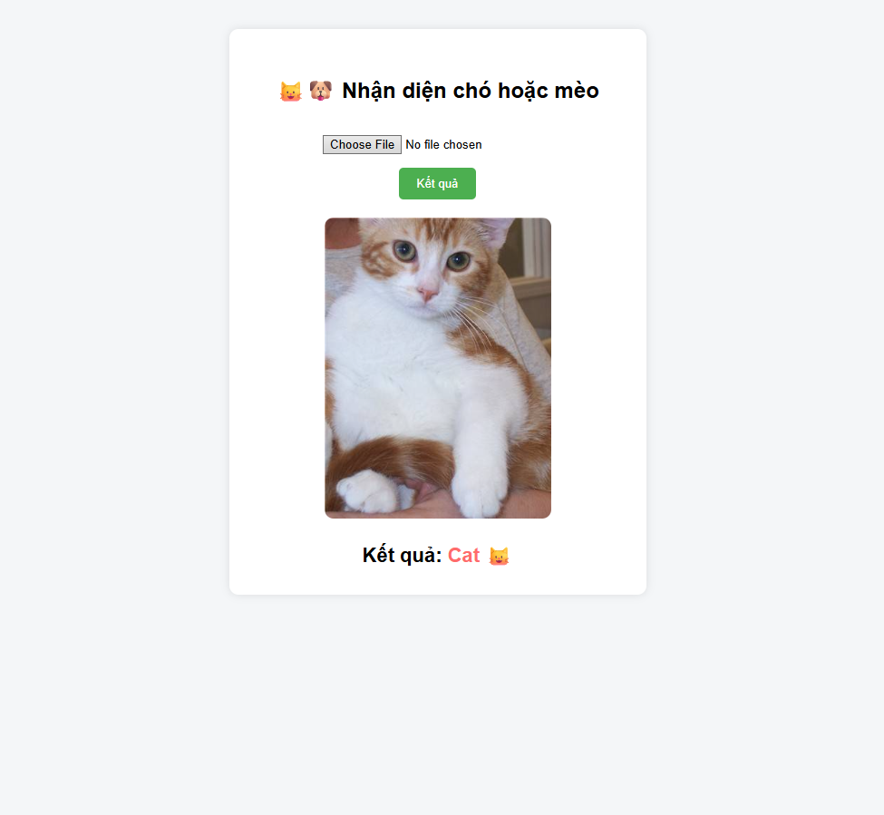
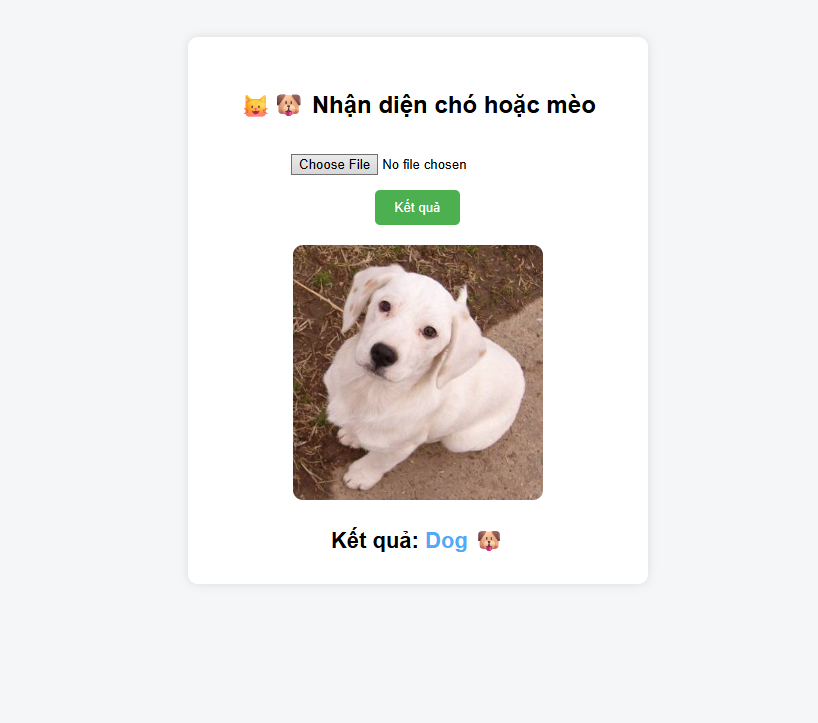

---Tính năng---
Tải ảnh lên từ giao diện web.

Sử dụng mô hình Deep Learning (ResNet18) để nhận diện.

Lưu trữ ảnh đã tải lên vào thư mục static/uploads

--- Cách hoạt động ---
Người dùng chọn một file ảnh (.jpg, .png).

Ảnh được lưu vào thư mục demo/images.

Mô hình PyTorch sẽ xử lý ảnh (Resize về 224x224) và đưa ra dự đoán là Cat (Mèo) hoặc Dog (Chó).

Kết quả được hiển thị ngay trên màn hình.